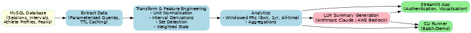

# 🚴‍♂️ Training Data Pipeline — End-to-End Cycling Analytics (Data Engineering Portfolio)

A **production-grade** data engineering project that transforms raw cycling telemetry into **business-ready insights**.  
It ingests structured training session data from **MySQL**, applies **robust transformations** & **feature engineering**, runs **time-window analytics** (8 weeks, 1 year, all-time), and generates **natural-language summaries** via LLMs — all delivered through a **secure Streamlit app** or a CLI batch runner.

> This pipeline goes beyond ETL. It showcases **real-world DE capabilities** — from **reliable ingestion** and **data quality safeguards** to **operational readiness** and **modular architecture**.

---

## 🎯 Why This Project Stands Out
- **Outcome-Driven** → Converts noisy, raw telemetry into **actionable performance insights**.
- **Production Mindset** → Caching, parameterized queries, secrets management, and testable modules.
- **Dual Run Modes** → Web app for exploration, CLI for automation/demo.
- **Recruiter-Friendly** → 1-command start, example configs, and a clear architecture diagram.

---

## 🏗 Architecture Overview



**Data Flow**  
`MySQL` → `extract_data` (cached, parameterized queries) → `normalize/derive features` → `detect sets + weighted stats` → `compute PRs (8wk / 1yr / all-time)` → `LLM summary` → `Streamlit UI` / `CLI`.

### **1. Ingestion**
- Streamlit SQL connection to MySQL for **sessions**, **intervals**, **athlete profiles**, and **record peaks**.
- **TTL caching** to reduce database load.
- Parameterized queries for **security** and **performance**.

### **2. Transformations & Feature Engineering**
- **Session-level normalization** → unit conversions, duration normalization, elevation adjustments, stimulus mapping.
- **Interval-level derivations** → torque (from power & cadence), intensity & characteristic labeling, deterministic ordering.
- **Set detection** over interval series with **weighted statistics**.

### **3. Analytics**
- **Windowed PR comparisons** → 8 weeks, 1 year, all-time.
- **Aggregations** → max improvements, counts, percentage changes.
- **Readable summaries** → optimized for LLM prompt consumption.

### **4. Delivery**
- **LLM summaries** via pluggable adapters:
  - [Anthropic Claude](https://www.anthropic.com/) or AWS Bedrock (Claude).
- **Streamlit App** with authentication.
- **CLI runner** for batch/demo without UI.

---

## 📂 Repository Layout
```
apps/
  summary_app/app.py             # Streamlit UI
training_data_pipeline/
  __init__.py, enums.py, utils.py
  db/                            # SQLModel engine & models
  summary_generation/            # Data extraction, formatting
  intervals/                     # Set detection & stats
  model/                         # LLM prompt + provider switch
  personal_achievements/         # Windowed PR analytics
scripts/
  production_summary_generator.py # CLI end-to-end run
.streamlit/
  config.example.yaml
  secrets.example.toml
pyproject.toml
.pre-commit-config.yaml
README.md
```

---

## ⚙️ Key Engineering Decisions
- **Streamlit SQL + TTL caching** → minimal DB load, swappable to SQLAlchemy for scaling.
- **JSON aggregation in SQL** → compact payloads, reduced round-trips.
- **Deterministic transforms** → null-safe conversions, predictable schema.
- **Clear window boundaries** for explainable PR analytics.
- **Secrets hygiene** → `.example` configs in repo, real secrets kept local/CI.
- **Pluggable LLM layer** → easy provider swap or offline mock.

---

## 🚀 Quick Start

**Prerequisites**
- Python 3.11
- Poetry

**Install**
```bash
poetry install
```

**Configure**
```bash
cp .streamlit/config.example.yaml .streamlit/config.yaml
cp .streamlit/secrets.example.toml .streamlit/secrets.toml
```
Fill in:
```toml
[connections.mysql]   # DB credentials
[api_key] or [aws]    # LLM access (optional)
```

**Run UI**
```bash
poetry run streamlit run apps/summary_app/app.py
```

**Run CLI (no DB/UI)**
```bash
poetry run python scripts/production_summary_generator.py
```

---

## 📊 Skills Demonstrated
✅ SQL design & optimization  
✅ Data ingestion from relational DBs  
✅ Feature engineering & derived metrics  
✅ Windowed analytics with reproducible outputs  
✅ Modular, production-ready Python architecture  
✅ Secrets/config management best practices  
✅ LLM integration for analytics summarization  
✅ Streamlit UI development  

---
